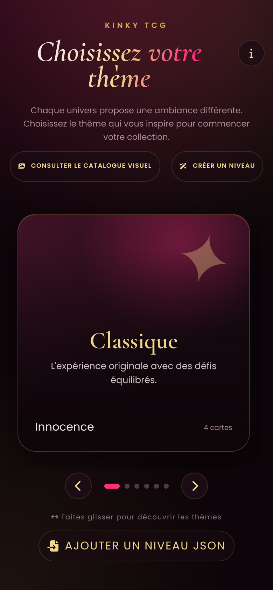
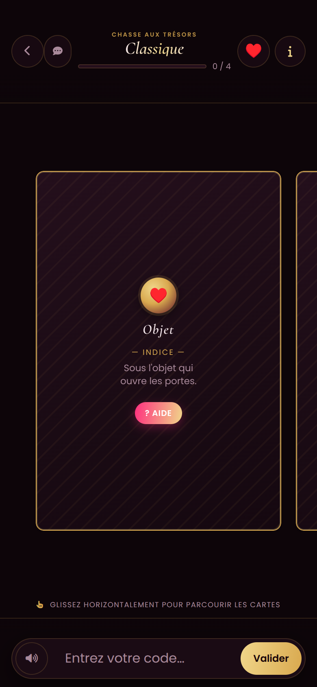
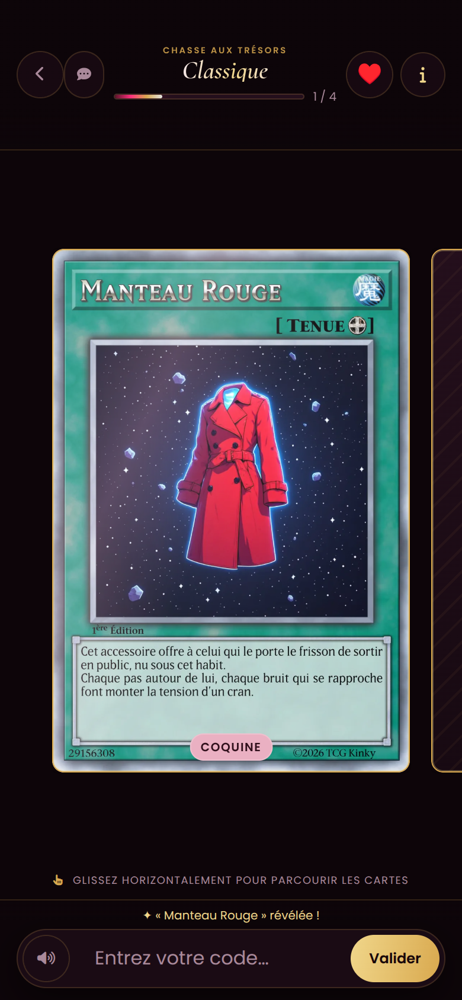

# 🎴 Kinky TCG

<div align="center">

**Un jeu d'énigmes et de cartes, basé sur le thème du kink et de l'érotisme.**

*Un maître du jeu crée un thème. L'autre résout les énigmes pour débloquer les cartes.*


[🎮 **Jouer**](https://laseronwood.github.io/game/tcgproto/) · [💻 **Voir le code**](https://github.com/LaserOnWood/kinky-tcg) · [🐛 **Signaler un problème**](https://github.com/LaserOnWood/kinky-tcg/issues)

</div>

> 🔞 **Contenu réservé aux adultes (18 ans et plus).** Kinky TCG est un jeu conçu pour les couples. Il aborde la sensualité et l'érotisme, et ses cartes proposent des gages et des mises en situation à caractère adulte. En continuant, vous confirmez être majeur·e et jouer avec un·e partenaire consentant·e.

## 📸 Aperçu

<p align="center">
  
  &nbsp;
  
  &nbsp;
  
</p>

<p align="center"><em>Choix du thème · Carte verrouillée et son indice · Carte révélée</em></p>

## 🎯 Le concept

Kinky TCG transforme un moment à deux en **chasse aux énigmes**. Chaque carte est cachée derrière un mot de passe. Pour le trouver, il faut réfléchir aux indices et fouiller son environnement. Quand le bon mot est saisi, la carte se retourne, dévoile son illustration et propose une **action à réaliser**.

Deux rôles :

| Rôle | Ce qu'il fait |
|---|---|
| 🎩 **Le maître du jeu** | Crée un thème : ambiance, cartes, énigmes et mots de passe. Il prépare la partie pour l'autre. |
| 🎯 **La personne cible** | Résout les énigmes pour débloquer les cartes, puis réalise les actions qu'elles proposent, sauf si la description d'une carte indique autre chose. |

## 🕹️ Comment se déroule une partie

1. 🎩 Le maître du jeu prépare un **thème** (ou choisit un des thèmes existants).
2. 🎯 La personne cible ouvre le jeu et **choisit le thème** dans le carrousel.
3. 🃏 Chaque carte verrouillée affiche son **type** et un **indice**. Les indices peuvent renvoyer à des objets ou à des lieux du quotidien.
4. 🔑 Elle **saisit le mot de passe** dans la barre du bas, puis appuie sur **Valider**.
5. 💡 Bloquée ? Le bouton **Aide** dévoile l'indice suivant, quand la carte en propose plusieurs.
6. ✨ Bonne réponse : la carte **se retourne** et révèle son illustration. Elle peut s'ouvrir en grand d'un simple toucher.
7. 🏁 La jauge de progression se remplit. Le thème est terminé quand toutes les cartes sont révélées.

## ✨ Fonctionnalités

| | Fonctionnalité | Description |
|---|---|---|
| 🎭 | **Thèmes** | Plusieurs ambiances, chacune avec sa difficulté et son sceau. |
| 🃏 | **Cartes à révéler** | Un type, un ou plusieurs indices, une rareté et une illustration par carte. |
| 🔄 | **Révélation animée** | Retournement 3D de la carte et effet holographique sur les illustrations. |
| 💡 | **Aide progressive** | Plusieurs indices par carte, du plus discret au plus explicite. |
| 💾 | **Progression conservée** | Cartes révélées et indices consultés restent dans le navigateur, thème par thème. |
| 🔐 | **Mots de passe protégés** | Seules les empreintes SHA-256 sont dans les données, jamais les mots en clair. |
| 🔊 | **Sons** | Effets pour les bonnes et mauvaises réponses, avec un bouton pour les couper. Quelques surprises sont cachées. |
| 🛠️ | **Atelier de niveaux** | Un outil pour créer, exporter et importer ses propres thèmes. |
| 🖼️ | **Catalogue visuel** | La page `gallery.html` liste toutes les illustrations, avec recherche, filtres et zoom. |
| 📴 | **Hors ligne** | Installable sur l'écran d'accueil et jouable sans réseau après une première visite. |
| 🔔 | **Notifications Discord** | Optionnelles : un message peut être envoyé à chaque carte révélée. |
| 💬 | **Retours anonymes** | Un formulaire permet d'envoyer un avis sans compte ni adresse e-mail. |
| 📱 | **Mobile d'abord** | Pensé pour le téléphone, confortable aussi sur tablette et ordinateur. |

## 🎭 Les thèmes

| Thème | Difficulté | En quelques mots |
|---|---|---|
| 🌸 **Classique** | Innocence | L'expérience originale, avec des défis équilibrés. |
| 🍃 **Zen & Douceur** | Innocence | Un moment de détente absolue et de connexion. |
| 🌚 **Aventure nocturne** | Transgression | Pour ceux qui aiment le mystère et l'exploration. |
| 🔞 **Anniversaire spécial** | Perversion | Fêter un anniversaire de façon exceptionnelle et le graver dans les mémoires. |
| 🎁 **Noël** | Perversion | Faire la fête de façon exceptionnelle et garder un souvenir inoubliable. |
| 💋 **Sortie nocturne** | Dépravation | Une petite sortie nocturne au parc ? |

### 🌶️ Les cinq niveaux de difficulté

| Niveau | Ambiance |
|---|---|
| Innocence | Le frisson du premier regard. |
| Transgression | L'interdit devient stimulant. |
| Perversion | Les pudeurs tombent, les rôles s'affirment. |
| Corruption | Les limites morales sont franchies. |
| Dépravation | Le lâcher-prise le plus total. |

### 💎 Les six raretés

Elles indiquent le caractère exceptionnel d'une carte, pas la difficulté de son mot de passe :

`Coquine` · `Provocante` · `Audacieuse` · `Envoûtante` · `Sulfureuse` · `Mythique`

## 🛠️ Créer son propre thème

### 🧙 Avec l'atelier de niveaux

Ouvrez `level-builder.html` (bouton **Créer un niveau** sur l'écran d'accueil). Vous y définissez le thème (nom, description, difficulté, sceau) puis ses cartes (titre, type, réponse, indices, image, rareté). Les réponses sont transformées en empreintes SHA-256 automatiquement. Le thème s'exporte en JSON par téléchargement ou par copie.

Sur l'écran d'accueil, le bouton **Ajouter un niveau JSON** importe un thème sur l'appareil, sans toucher au code.

### 📝 À la main, dans `json/cartes.json`

Les thèmes officiels sont dans `json/cartes.json`, sous la forme `{ "themes": [ … ] }`. Une carte ressemble à ceci :

```json
{
  "id": 101,
  "type": "Objet",
  "passwordHash": "<hash SHA-256 du mot de passe>",
  "hints": ["Premier indice", "Second indice, plus explicite"],
  "title": "Titre de la carte",
  "image": "assets/cartes/Dossier/Image.webp",
  "description": "Description de la carte.",
  "actions": "Texte optionnel.",
  "rarity": "Coquine"
}
```

| Champ | Rôle |
|---|---|
| `id` | Entier unique dans le thème. |
| `type` | Mot affiché au dos de la carte. |
| `passwordHash` | Hash SHA-256 du mot de passe en minuscules, sans espaces autour. |
| `hints` | Liste d'indices : le premier s'affiche d'abord, **Aide** passe aux suivants. |
| `title`, `description` | Textes de la carte. |
| `image` | Chemin relatif ou URL de l'illustration. |
| `actions` | Optionnel. Repris dans la notification Discord. |
| `rarity` | Une des six raretés ci-dessus. |

Le fichier est du JSON strict, sans commentaires. Le jeu vérifie chaque carte au chargement et signale clairement les erreurs.

**🔑 Générer un hash** : ouvrez le jeu, puis dans la console du navigateur :

```js
await genererHash("mon-mot-de-passe")
```

Le mot est comparé en minuscules et sans espaces autour, mais **les accents comptent** (« clé » et « cle » donnent deux hashs différents). Ne mettez jamais un mot de passe en clair dans le dépôt.

**🖼️ Images** : le format recommandé est le WebP, environ 1000 px de large (une carte s'affiche à 340 px au maximum sur téléphone).

## 🖼️ Le catalogue visuel

`gallery.html` réunit toutes les illustrations de `assets/cartes/` : recherche, filtres par catégorie, zoom. Pratique pour le maître du jeu qui compose un thème. ⚠️ Cette page **dévoile toutes les illustrations** : à ne pas ouvrir devant la personne cible.

## 📴 Hors ligne et installation

Un manifeste (`manifest.webmanifest`) et un service worker (`sw.js`) rendent le jeu installable sur l'écran d'accueil et utilisable sans connexion, par exemple pour un thème qui se joue en extérieur.

- Après une première visite en ligne, les fichiers du jeu et les illustrations des thèmes sont mémorisés.
- Les fichiers du jeu sont récupérés en priorité sur le réseau : une mise à jour publiée s'affiche dès qu'il y a une connexion.
- Hors ligne, les notifications Discord ne sont pas envoyées, et les sons peuvent ne pas fonctionner selon l'appareil.

## 🔔 Notifications Discord et retours

Deux fonctions serveur (`api/notification.js` et `api/feedback.js`) relaient les messages vers Discord. Les adresses de webhook restent côté serveur, dans les variables d'environnement, et ne sont jamais dans le code :

| Variable | Rôle |
|---|---|
| `DISCORD_NOTIFICATION_WEBHOOK_URL_1`, `_2`, … | Une ou plusieurs adresses recevant une notification à chaque carte révélée. |
| `FEEDBACK_DISCORD_WEBHOOK_URL` | Adresse recevant les retours anonymes. |

Le fichier `.env.example` montre le format. Ne commitez jamais un vrai fichier `.env`.

Sans configuration, le jeu fonctionne normalement : l'envoi échoue en silence et ne bloque jamais le déblocage d'une carte.

> 👀 **À savoir pour les joueurs :** une notification contient le titre de la carte, sa rareté, sa description, l'action éventuelle, son illustration, le niveau choisi et **le mot saisi**.

Ces fonctions ne tournent que sur Vercel. Sur un hébergement statique (GitHub Pages, FTP), le jeu reste jouable, mais sans notifications ni retours. C'est le cas du lien public « Jouer » ci-dessus.

## 🚀 Lancer le jeu en local

Les cartes sont chargées avec `fetch` : il faut passer par un serveur HTTP local plutôt que d'ouvrir `index.html` directement.

```bash
python3 -m http.server 8000
```

Ouvrez ensuite <http://localhost:8000>. Pour tester aussi les notifications et les retours, utilisez la [CLI Vercel](https://vercel.com/docs/cli) (`vercel dev`).

## 🗂️ Structure du projet

```text
.
├── index.html            # Écran d'accueil et jeu
├── gallery.html          # Catalogue visuel des illustrations
├── level-builder.html    # Atelier de niveaux
├── manifest.webmanifest  # Installation sur l'écran d'accueil
├── sw.js                 # Service worker (mode hors ligne)
├── api/                  # Fonctions serveur Vercel (Discord)
├── assets/
│   ├── cartes/           # Illustrations, classées par catégorie
│   ├── audio/            # Effets sonores
│   └── ico/              # Icône
├── css/                  # Feuilles de style
├── js/
│   ├── passemot.js       # Logique principale du jeu
│   ├── audio.js          # Sons
│   ├── carousel.js       # Carrousel de thèmes
│   ├── feedback.js       # Formulaire de retours
│   ├── notification.js   # Envoi des notifications
│   ├── hasheur.js        # Générateur de hash (console)
│   ├── gallery.js        # Catalogue
│   └── level-builder.js  # Atelier de niveaux
├── json/
│   ├── cartes.json       # Thèmes et cartes du jeu
│   └── gallery.json      # Inventaire des images (généré)
├── docs/screenshots/     # Captures d'écran du README
├── scripts/              # Outils de maintenance (Node.js)
└── .github/workflows/    # Publication et optimisation
```

## 🧰 Outils de maintenance

| Commande | Rôle |
|---|---|
| `npm run gallery:index` | Régénère `json/gallery.json` à partir de `assets/cartes/`. |
| `npm run gallery:watch` | Régénère l'inventaire à chaque changement dans `assets/cartes/`. |
| `node scripts/optimize-images.mjs` | **Simulation** : liste ce que l'optimisation des images ferait, sans rien modifier. |
| `node scripts/optimize-images.mjs --apply` | Redimensionne les images à 1000 px de large et les convertit en WebP. Nécessite `npm install sharp`. |

L'optimisation existe aussi comme workflow GitHub : onglet **Actions**, « Optimiser les images », **Run workflow**. Sans case cochée, c'est une simulation ; en cochant la case, les images sont modifiées et le résultat est enregistré dans `main`.

## ☁️ Déploiement

Le dépôt `LaserOnWood/kinky-tcg` est la source unique du projet. Chaque push sur `main` publie le jeu :

| Destination | Fonctionnement |
|---|---|
| ▲ **Vercel** | Hébergement avec fonctions serveur (notifications, retours). Se met à jour à chaque push. |
| 🐙 **GitHub Pages** | Le workflow `sync-to-site.yml` copie le jeu dans `game/tcgproto` du dépôt `LaserOnWood.github.io`. Il demande le secret `SITE_REPO_TOKEN`. C'est le lien public « Jouer ». |
| 📡 **Hébergement FTP** | Le workflow `lws.yml` envoie les fichiers par FTP. Il demande les secrets `FTP_SERVER`, `FTP_USERNAME` et `FTP_PASSWORD`. |

Un commit fait par un workflow ne déclenche pas les autres workflows : après « Optimiser les images », lancez « Synchroniser avec le site principal » à la main.

Les chemins du jeu doivent rester **relatifs** (`css/main.css`, `js/passemot.js`), car il est aussi publié dans un sous-dossier. Évitez la balise `<base>`.

## 🧱 Technologies

HTML, CSS et JavaScript natifs, sans étape de compilation, avec [Bootstrap](https://getbootstrap.com/), [Font Awesome](https://fontawesome.com/) et Google Fonts ([Cormorant Garamond](https://fonts.google.com/specimen/Cormorant+Garamond) et [Poppins](https://fonts.google.com/specimen/Poppins)) chargés depuis des CDN. L'API Web Crypto calcule les empreintes SHA-256. Node.js n'intervient que pour les outils de maintenance.

## 🗺️ Prochaines étapes

**Déjà en place** dans les dernières versions :

- [x] 📴 Mode hors ligne et installation sur l'écran d'accueil
- [x] 🪶 Illustrations allégées (environ 80 % de poids en moins)
- [x] 🔄 Retournement 3D des cartes à chaque déblocage
- [x] 🛠️ Atelier de niveaux et catalogue visuel

**Idées à l'étude** :

- [ ] 🔞 Écran d'avertissement 18+ à l'entrée du jeu
- [ ] 🔤 Réponses tolérantes : accents, majuscules et espaces ignorés
- [ ] 💾 Export et import de la progression, pour changer d'appareil
- [ ] 🃏 Carte « Joker » pour passer un gage, avec des limites choisies par les joueurs
- [ ] 🎨 Thèmes finalisés : illustrations et mots de passe définitifs pour chacun
- [ ] 🔒 Protection renforcée des mots de passe et du contenu des cartes
- [ ] 🌍 Traduction anglaise

## 🤝 Contribuer

Les contributions cohérentes avec l'esprit et l'architecture du jeu sont les bienvenues : corrections, améliorations d'accessibilité, traductions, nouveaux thèmes.

1. 💬 Ouvrez d'abord une **issue** pour les changements importants.
2. 🌿 Travaillez sur une branche dédiée.
3. ✅ Testez le parcours complet sur téléphone et ordinateur : choix du thème, déblocage d'une carte, progression, retour à l'accueil, et le jeu hors ligne si vous touchez à `sw.js`.
4. 🔀 Ouvrez une **pull request** qui décrit le problème et le comportement attendu.

Les illustrations proposées doivent être des créations fictives : **aucune image de personne réelle**.

## 🎨 Crédits

| | |
|---|---|
| 👤 **Concept, prompts et développement** | AzaSwitch |
| 🖼️ **Illustrations** | Générées avec **Stable Diffusion** à partir des prompts d'AzaSwitch, puis mises en forme avec le générateur de cartes [YGO Carder](https://lauqerm.github.io/ygocarder/) de Lauqerm. |
| 🔊 **Sons** | Récupérés sur [MyInstants](https://www.myinstants.com/fr/index/fr/). Les droits appartiennent à leurs ayants droit respectifs. |
| 🧩 **Bibliothèques et polices** | Bootstrap, Font Awesome, Cormorant Garamond, Poppins. |

> ℹ️ Kinky TCG est un projet indépendant, **non affilié à Konami**. *Yu-Gi-Oh!* est une marque de Konami Digital Entertainment.

## 📜 Licence

- 💻 **Code** (HTML, CSS, JavaScript, fonctions serveur, scripts, workflows) : licence **MIT**, voir le fichier [`LICENSE`](LICENSE).
- 🎴 **Contenus** (illustrations, textes et données des cartes, sons) : **non couverts par la licence MIT**. Tous droits réservés, hors éléments tiers listés dans les crédits. Ne les réutilisez pas sans l'accord de l'auteur.